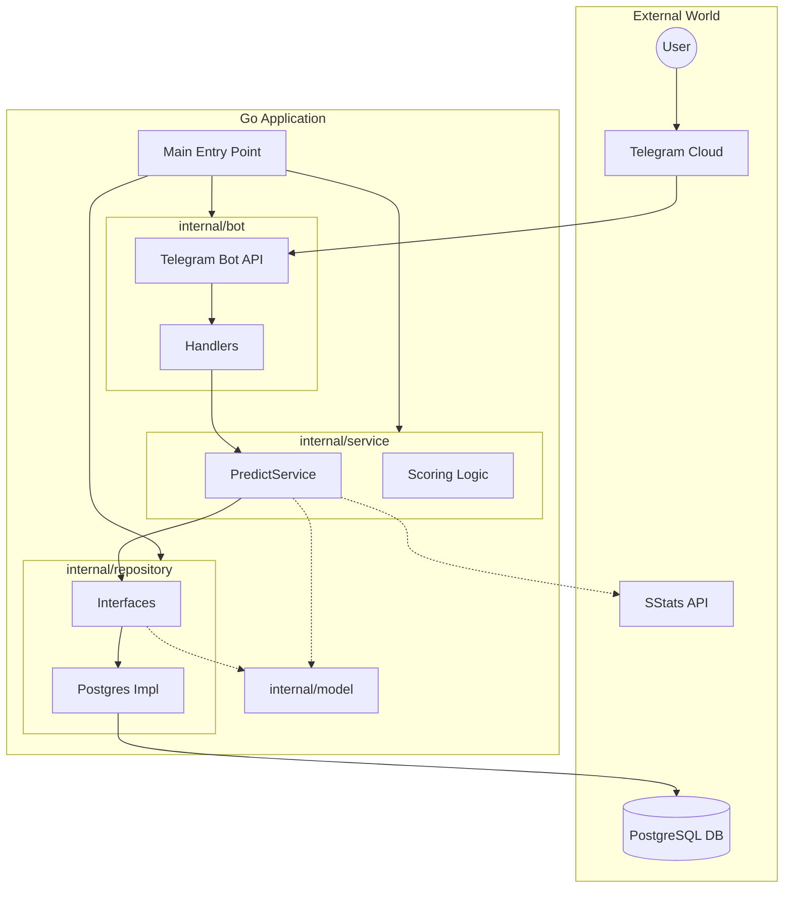

# 🏗 Architecture Diagram

```mermaid
graph TD
    subgraph External ["External World"]
        User(("User"))
        Telegram["Telegram Cloud"]
        SStats["SStats API"]
        DB[("PostgreSQL DB")]
    end

    subgraph GoApp ["Go Application"]
        Main["Main Entry Point"]
        
        subgraph BotLayer ["internal/bot"]
            BotAPI["Telegram Bot API"]
            Hnd["Handlers"]
        end
        
        subgraph ServiceLayer ["internal/service"]
            Svc["PredictService"]
            Calc["Scoring Logic"]
        end
        
        subgraph RepoLayer ["internal/repository"]
            Intf["Interfaces"]
            Impl["Postgres Impl"]
        end
        
        Models["internal/model"]
    end

    User --> Telegram
    Telegram --> BotAPI
    BotAPI --> Hnd
    Hnd --> Svc
    Svc --> Intf
    Intf --> Impl
    Impl --> DB
    
    Svc -.-> SStats
    Svc -.-> Models
    Intf -.-> Models
    Main --> BotLayer
    Main --> ServiceLayer
    Main --> RepoLayer
```